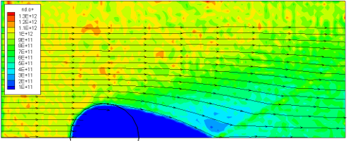
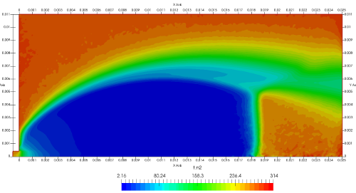
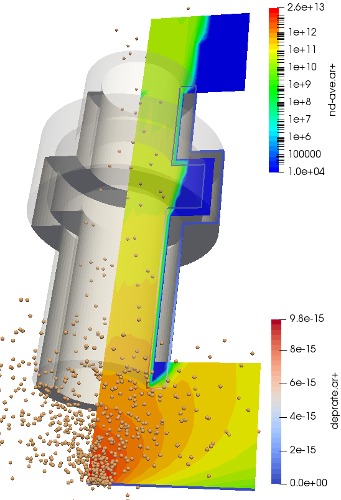

# Starfish

[Starfish](https://www.particleincell.com/starfish) is a 2D (Cartesian or axisymmetric) code for simulating a wide range of plasma and gas problems.
It implements the electrostatic Particle-in-Cell (ES-PIC) method along with several fluid solvers. Material interactions are included through
MCC or DSMC collisions, or via chemical reactions. The computational domain can be divided into multiple rectilinear or body-fitted meshes, and linear/cubic
splines represent the surface geometry. The code can be easily extended with plugins. Starfish is written in Java and is actively being developed.

## Getting Started

### Installation

#### For user purposes

Download a Jar file from the [Releases](https://github.com/particleincell/Starfish/tags) page. 

There are two versions: a simple, standalone command-line UI and a GUI equipped with advanced features.

1. For the CLI: Download StarfishCLI.jar and run it using `java -jar StarfishCLI.jar`
2. For the GUI: Download Starfish.jar, [follow these instructions to install VTK](https://www.particleincell.com/2011/vtk-java-visualization/), and run Starfish using `java -jar Starfish.jar`

*warning*: GUI is experimental and may not support all operating systems or display servers

#### For developer purposes

Starfish requires some external libraries in order to run. This project has a Dockerfile that can create a [container](https://www.docker.com/resources/what-container/). The container not will correct software versions and will automatically download and build any libraries required, but it will keep everything for this project separate from the rest of the OS to prevent version conflicts between different projects. This project comes with configurations for Visual Studio Code to best utilize the container's capabilities.

1. Download and Install Docker and Visual Studio Code
2. In VSCode, download the [Dev Container extension](https://marketplace.visualstudio.com/items?itemName=ms-vscode-remote.remote-containers)
3. Download this repo and open the folder in VSCode
4. Create the Dev Container by pressing `CTRL + SHIFT + P` and executing the command `Open Folder in Container`.

### How to Use

Start by taking a look at a five-step 
[ES-PIC](https://www.particleincell.com/2012/starfish-tutorial-part1/) and [DSMC](https://www.particleincell.com/2017/starfish-tutorial-dsmc/) tutorials.
Input files for the tutorials are included in the dat directory. On the PIC-C website you will also find
a [PowerPoint presentation](doc/starfish-code-overview.pdf) with some introductory remarks about the source code. The associated video is [available here](https://www.youtube.com/watch?v=IDFeT_X-IsU).

# Examples

Input files for these examples are located in the dat/ folder.

|                                                  |                                                                                                            |
|--------------------------------------------------|------------------------------------------------------------------------------------------------------------|
|        | Axial velocity of ions streaming past a charged sphere                                                     |
|  | DSMC computation of temperature in an atmospheric jet expanding to a low pressure tank                     |
|            | Number density of ions flowing through a sectioned tube computed on a domain consisting of multiple meshes |

# Bug Reporting

The code is under ongoing development and may contain numerous bugs. Please submit a bug report if you find anything odd!

# License

Please view LICENSE for license terms. 

(c) 2012-2022 Particle In Cell Consulting LLC

# Contact
Contact us [by visiting the website](https://www.particleincell.com/contact/) 
or on Twitter [@particleincell](https://twitter.com/particleincell).

# Revision History
- v0.24 Magnetostatic and Geng generalized Ohm's law solver
- v0.22 GUI, multi-mesh support for multiple corners, command line arguments, trace command rewrite, cell "CFL" subcycling
- v0.21 Support for sigmas to be used for chemical reaction rates
- v0.20.5 Time dependent boundaries, fix to surface sampling
- v0.20 Rename of Starfish-LE to Starfish, addition of thermionic emission, evaporation, and particle merge
- v0.19 Re-enables support for multi-domain simulations
- v0.16.2 Various bug fixes related to DSMC and ambient boundary source
- v0.16 Addition of a DSMC module (previously included in the full version)
- v0.15 Initial release of PIC-MCC code

