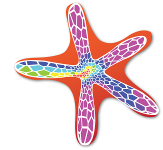

# Starfish-LE

[Starfish](https://www.particleincell.com/starfish) is a general 2D Cartesian or axisymmetric code for simulating plasmas or rarefied gases. 
It consists of two "editions", light and regular. The light edition is what is posted here.
It includes support for the Particle In Cell (PIC) method with MCC or DSMC collisions,
several gas injection sources, and preliminary support for fluid and kinetic materials. The
code can be easily extended with plugins. 

The full version implements a
Navier Stokes solver and sources specific to plasma thrusters. This version is not publicly available.

## Getting Started
Start by taking a look at a five-step 
[ES-PIC](https://www.particleincell.com/2012/starfish-tutorial-part1/) and [DSMC](https://www.particleincell.com/2017/starfish-tutorial-dsmc/) tutorials.
Input files for the tutorials are included in the dat directory. On the PIC-C website you will also find
a [PowerPoint presentation](dat/tutorial/starfish-code-overview.pdf) with some introductory remarks about the source code. The associated video is [available here](https://www.youtube.com/watch?v=IDFeT_X-IsU).

# Examples

DSMC computation of temperature in an atmospheric jet expanding to a low pressure tank

# Bug Reporting
This is an early version and is likely full of bugs. Please submit a bug report if you find anything odd!

# License
Please view LICENSE for license terms. 

(c) 2012-2017 Particle In Cell Consulting LLC

# Contact
Contact us [by visiting the website](https://www.particleincell.com/contact/) 
or on Twitter [@particleincell](https://twitter.com/particleincell).

# Revision History
- v0.16.2 Various bug fixes related to DSMC and ambient boundary source
- v0.16 Addition of a DSMC module (previously included in the full version)
- v0.15 Initial release of PIC-MCC code

